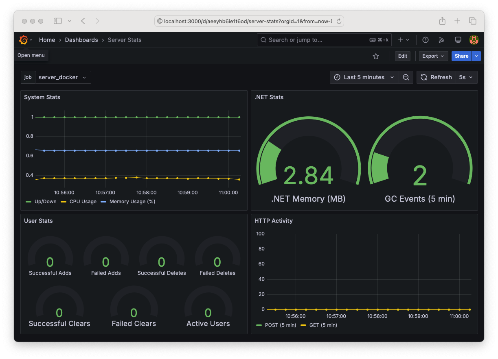

# CoreWebApp

This is a simple C# ASP.NET Core web app developed to show creation of web APIs, exporting of Prometheus metrics, Dockerization of the app, and visualizing metrics with a Grafana dashboard. It includes APIs for managing a user list, custom Prometheus metrics, and a Dockerized deployment. Instructions are tested on Ubuntu Linux, and other operating systems may require adjusted commands.

The APIs are described in [APIs](#APIs).

## Prerequisites

Install the .NET 9 virtual machine and *curl* with:

```
sudo apt install -y dotnet-sdk-9.0 curl
```

See the [Docker](#Docker) section for packages needed to build/run a Dockerized version.


## APIs

API ports:

- **VS Code Debug**: Port `5000`
- **Dockerized**: Port `8080` (default for examples below)

Replace "8080" with "5000" in `curl` commands when running in VS Code.

### /health

Returns a 200 status code if the app is running.

Example:

```
curl http://localhost:8080/health 
```

### /metrics

Returns Prometheus metrics.

Custom metrics include:

* `successful_user_adds`: Number of successful user adds (counter)
* `failed_user_adds`: Number of failed user adds (counter)
* `successful_user_deletes`: Number of successful user deletes (counter)
* `failed_user_deletes`: Number of failed user deletes (counter)
* `successful_user_clears`: Number of successful user deletes (counter)
* `failed_user_clears`: Number of failed user deletes (counter)
* `num_active_users`: Number of users (gauge)

Example:

```
curl http://localhost:8080/metrics 
```

Best queried from Prometheus or Grafana!

### /stats

Returns CPU usage, processor count, OS version, and number of users.

Example:

```
curl http://localhost:8080/stats 
```

### /getusers

Returns the name and age of users who have been added to the system along with an integer user ID.

Example:

```
curl http://localhost:8080/getusers 
```

### /adduser

Add a user to the system with firstName, lastName, and age.

Example:

```
curl -X POST -H "Content-Type: application/json" -d '{"firstName":"Fred", "lastName":"Foobar", "age":42}' http://localhost:8080/adduser
```

Users are internally assigned IDs starting with 0, and the API returns the ID assigned during successful user adds. This value is needed to later delete a user.

### /deluser

Remove a user with the specified user ID.

Example:

```
curl -X POST -H "Content-Type: application/json" -d '{"Id":0}' http://localhost:8080/deluser
```

### /clearusers

Clear the user list. Pass in the current number of users (obtainable via the *stats* API) via NumUsers as a safety check.

Example (currently 10 users):

```
curl -X POST -H "Content-Type: application/json" -d '{"numUsers":10}' http://localhost:8080/clearusers
```

## Docker

### Installation check

See if Docker is installed:

```
command -v docker
```

If so, check that the user is a member of the *docker* group, which is needed for running containers:

```
groups | grep docker
```

If both these checks pass, then jump down to [Build the container](#Build-the-container). If Docker is installed but not runnable by the current user, then either preface the `docker` commands with `sudo` or follow the instructions in [Verify Docker can be run by the user](#Verify-Docker-can-be-run-by-the-user).

### Install Docker

Follow the instructions in this section to install Docker. See [Docker docs](https://docs.docker.com/engine/install/ubuntu/) for detailed installation help.

Install the Docker GPG key:

```
curl -fsSL https://download.docker.com/linux/ubuntu/gpg | sudo gpg --dearmor -o /usr/share/keyrings/docker-archive-keyring.gpg
```

Add the Docker repository:

```
echo "deb [arch=$(dpkg --print-architecture) signed-by=/usr/share/keyrings/docker-archive-keyring.gpg] https://download.docker.com/linux/ubuntu $(lsb_release -cs) stable" | sudo tee /etc/apt/sources.list.d/docker.list > /dev/null
```

Update the package index and upgrade installed packages:

```
sudo apt update && sudo apt upgrade -y
```

Install Docker engine:

```
sudo apt install -y docker-ce docker-ce-cli containerd.io
```

### Verify Docker can be run by the user

Check if the login user is already a member of the `docker` group:

```
groups | grep docker
```

If so, skip to [Build the container](#Build-the-container). If not, first check that the `docker` group exists:

```
getent group docker
```

Troubleshooting the non-existance of the `docker` group is out of scope of this README.

Then, add the user to the `docker` group with:

```
sudo usermod -aG docker $USER
```

Log out and log back in again to put the change into effect.

### Build the container

```
cd CoreWebApp/Server
docker build -t server:latest .
```

### Run the container and map API ports

The Dockerfile specifies running the APIs on port 8080, so map this port between the container and localhost when creating the image:

```
docker run -d -p 8080:8080 --name server-container server:latest
```

Open a browser and navigate to http://localhost:8080/health or run `curl localhost:8080/health` to verify that the app is running in the container.

## Prometheus

### Install Prometheus

```
sudo apt install prometheus -y
```

### Configure Prometheus

Open the Prometheus configuration file (substitute your favorite editor for `vi`):

```
sudo vi /etc/prometheus/prometheus.yml
```

Scroll down to the *scrape_configs:* section at the bottom of the file. There will likely already be jobs called *prometheus* and *node*. Add *server_debug* and *server_docker* jobs after them as follows, and ensure proper YAML indentation (2 spaces) to avoid errors:

```
scrape_configs:

  - job_name: 'server_debug'

    scrape_interval: 5s
    scrape_timeout: 5s

    static_configs:
      - targets: ['localhost:5000']

  - job_name: 'server_docker'

    scrape_interval: 5s
    scrape_timeout: 5s

    static_configs:
      - targets: ['localhost:8080']
```

This points Prometheus at both VS Code debug and Docker instances. A variable in the Grafana dashboard will allow switching between them.

Save the file and exit the editor.

Check config file syntax with:

```
promtool check config /etc/prometheus/prometheus.yml
```

Fix any mistakes, then restart Prometheus and check that it's running:

```
sudo systemctl restart prometheus
sudo systemctl status prometheus
```

### Checking Prometheus metrics

Open a browser and navigate to http://localhost:9090/classic/targets to view available endpoints.

Target *server_docker* should appear in blue indicating a connection if the Docker container is running. Running the app in the VS Code debugger will activate the *server_debug* target.

## Grafana

### Install Grafana 

Install the Grafana GPG key:

```
curl -fsSL https://apt.grafana.com/gpg.key | sudo gpg --dearmor -o /etc/apt/keyrings/grafana.gpg
```

Add the Grafana stable repository:

```
echo "deb [signed-by=/etc/apt/keyrings/grafana.gpg] https://apt.grafana.com stable main" | sudo tee -a /etc/apt/sources.list.d/grafana.list > /dev/null
```

Update the package index and upgrade installed packages:

```
sudo apt update && sudo apt upgrade -y
```

Install Grafana OSS. This is the free-to-use, open-source version released under the Apache 2.0 license.

```
sudo apt-get install -y grafana
```

### Start Grafana

Start Grafana:

```
sudo systemctl daemon-reload
sudo systemctl start grafana-server
```

Verify that Grafana is running:

```
sudo systemctl status grafana-server
```

### Connecting to Grafana

Verify that Grafana is running by opening a browser and navigating to http://localhost:3000 to view the dashboard. The default username/password is `admin`/`admin`. You can choose a stronger password if you wish, otherwise click *Skip* at the bottom of the password-change form. This should bring you to a *Welcome to Grafana* page.

### Configure a data source for the Server app

From the Grafana main dashboard, click the spiral menu icon in the top-left corner and select *Connections*. Type *Prometheus* into the search bar, then click on the *Prometheus* icon that appears in the *Data sources* panel. Click on the *Add data source* button that appears in the top-right corner of the screen.

Get the UID of the data source from the page URL. For example, if the URL is:

```
http://localhost:3000/connections/datasources/edit/bef1irc8cho1sc
```

Then the UID is *bef1irc8cho1sc*. This will be needed shortly.

Type in a descriptive name like *Prometheus Server* for the data source and specify *http://localhost:9090* for the server URL. Scroll to the bottom of the page and click *Save and test*. A message *Successfully queried the Prometheus API.* should pop up in green. If not, make sure that Prometheus 

### Map UIDs in Server dashboard

Open a terminal window an *cd* to *~/CoreWebApp/dashboards*.

```
cd ~/CoreWebApp/dashboards
```

Then type:

```
grep uid server_dashboard.json
```

The top UID should say *"-- Grafana --"* and the bottom UID will be for the dashboard. In between should be the same UID repeated multiple times at different levels of indentation, such as *"uid": "cee25gg4nj9xcc"*.

Create a new JSON file with the datasource UID updated to the one created in the previous section. Replace the placeholder UID (e.g., `cee25gg4nj9xcc`) in `server_dashboard.json` with your data source UID (e.g., `bef1irc8cho1sc`) using:

```
sed 's/cee25gg4nj9xcc/eef1ehsondx4wc/g' server_dashboard.json > my_server_dashboard.json
```

### Import the Server dashboard

Click the menu icon in the top-left corner and select *dashboards*. Click *new* then *import*. Import *my_server_dashboard.json* file from the *./dashboards* directory either by dragging it onto upload widget or opening it in a text editor and copying the JSON into the text widget. Don't change the UID. Then click *Import* The dashboard may initially render with panels displaying *No data* messages. If so, refresh the page to begin displaying data.

The *job* dropdown should allow selecting between *server_docker*, *server_debug*, and any other configured data sources.

The dashboard should appear as follows:



### Updating metrics

The *curl* commands in [APIs](#APIs) can be used to hit the web APIs and move the statistics. Use port 8080 if running Server in a Docker container or 5000 if running in VS Code.

For example, typing the following should increase *Successful Adds* and *Active Users* along with *POST (5 min)*:

```
curl -X POST  -H "Content-Type: application/json" -d '{"firstName":"Fred", "lastName":"Foobar", "age":42}' http://localhost:8080/adduser
```

## Optional configuration

This optional section enables Grafana to expose its own metrics to Prometheus, enhancing monitoring capabilities. They're not scraped for the *System Stats* dashboard loaded earlier.

### Configure Grafana to generate data for Prometheus

Open the Grafana configuration file (substitute your favorite editor for `vi`):

```
sudo vi /etc/grafana/grafana.ini
```

Scroll down to `Internal Grafana Metrics` and uncomment (remove the semicolon) the lines:

```
enabled = true
```

and

```
disable_total_stats = false
```

Then, restart Grafana and verify that it's running:

```
sudo systemctl restart grafana-server
sudo systemctl status grafana-server
```

### Configure Prometheus to scrape Grafana data

Open the Prometheus configuration file (substitute your favorite editor for `vi`):

```
sudo vi /etc/prometheus/prometheus.yml 
```

Scroll down to the bottom and add a new job:

```
  - job_name: 'grafana_metrics'

    scrape_interval: 5s
    scrape_timeout: 5s

    static_configs:
      - targets: ['localhost:3000']
```

Verify the configuration file:

```
promtool check config /etc/prometheus/prometheus.yml
```

Fix any mistakes then restart Prometheus and check that it's running:

```
sudo systemctl restart prometheus
sudo systemctl status prometheus
```


